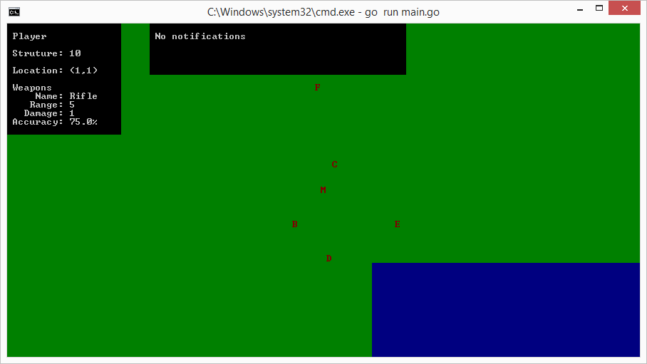
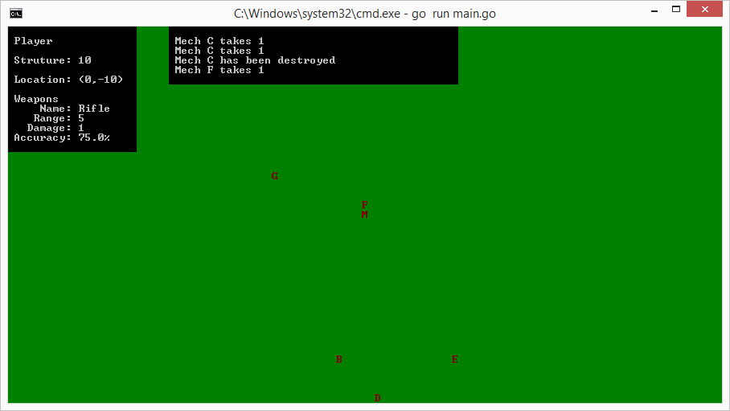

# [Frame Assault 0.002](https://github.com/Ariemeth/frame_assault)

## Summary
Frame Assault 0.002 is a turn based terminal game where you move a mech around destroying any enemy mechs that you encounter.  Mechs come equipped with a range of weapons from rifles and shotguns to clubs and axes.  

## Installation

~~~
git clone https://github.com/Ariemeth/frame_assault

go get -u github.com/Ariemeth/termloop

cd frame_assault

go run main.go
~~~

## How to play
To move the mech around use the arrow keys. The player is the red M in the center of the screen.  To select an enemy to attack press the key corresponding to the name of the enemy.  On the left side of the display is a status panel with some basic information about your mech.  To exit press ESC.  I recommend a minimum terminal size of 80x40.  

## Making of
Parts of Frame Assault 0.002 are from a project I started two months before starting this project to start learning go.  In the beginning I spend hours going through go documentation trying to figure out what existed to do what I wanted to do.  Those early days were spent learning how to use structs and interfaces with many confusing problems trying to implement some interfaces.  As many projects go after a few weeks my Frame Assault got less and less of my time.

Then I heard about the Go Game Jam and found the perfect opportunity to get pulled back into go.  While waiting for the Jam to start I'd already started looking more into [termloop](https://github.com/JoelOtter/termloop) and found it to be a great console engine and decided that I would be using that for the Jam.

Finally the Game Jam started and work kept me busy, so I had to put it off for almost 24 hours.  Once I started I copied in some of my older mech and weapon files and tried to get a basic game loop running.  With termloop this was quick and easy.  Next I needed to work on expanding the mech class to function as an entity.  This was actually pretty easy as well.  More time was spent figuring out how to keep the player centered then actually getting the controls and collision to work.  Of course once I realized the documentation for termloop goes over how to do this there was a few minutes of feeling foolish for not reading over the documentation better.

Next I went to work on a status display.  I had expected this to be quick and easy.  It should have been if I had designed my other structured better initially.  After getting the basic display up I didn't want it moving around as the player moved, I wanted it to be static in a location I would choose.  This lead down a long path of trying to manually create and update offsets which worked great, until I realized I could just use the offsets in the termloop Level class to handle this for me.  This allowed me to refactor quite a bit of useless code out of the Status class.

At this point I was ready to start adding some enemy mechs into the world to destroy even if I wouldn't have time to add AI.  Unfortunately this is where I run out of time.

At this point there is a green world with a small blue lake.  The player can move a mech around and see their status in the top left section of the display. You can see enemy mechs that do not move around you. If you move within range of an enemy and use the letter of the enemy you will attack.  Enemies should require 2 hits to be destroyed. While I didn't finish the basic game I had hoped to get done, I learned a lot more about go and started to feel that I was actually getting the language down instead of having to constantly look back at what the signature needed to be for everything.  Going forward even after the Jam I plan on continuing work to get it to the basic game idea I originally had wanted it to be to include enemies that move, attack back and utilize the accuracy of weapons.

## Tools used
For Frame Assault 0.002 I used Atom with the go plus package.  I tried a few different terminal packages but they just didn't work as well as I would like, so I ended up using a separate terminal window to test from.  I used the Hack font, Nucleus Dark UI theme and the VisualDark Syntax theme.

## Screenshots

